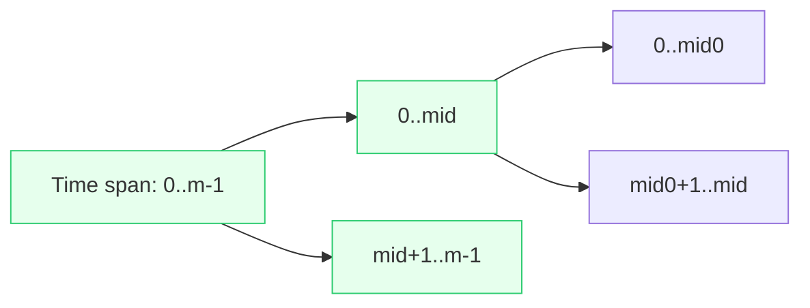

# Offline Dynamic Connectivity (DSU Rollback + Segment Tree)

## Problem Statement

We have a network (graph) of nodes. Edges can be added or removed over time. We get queries at certain times asking: "Are node A and node B connected right now?" 🔎

You cannot easily keep the graph updated step-by-step when there are many changes. So we use a neat trick: we plan all changes, then answer the queries by grouping edge lifetimes and using a data structure that can "undo" changes (rollback) while we explore time intervals.

## Real world scenarios

- A social network where friendships come and go; we ask if two people are in the same friend-group at different times. 🙂
- A road network where roads open/close for repairs; we ask if there's a path between two cities at certain times. 🚗

## Solution

Idea in simple words:

1. Record when each edge is added and removed. If an edge is added and later removed, it is active only for that time window.
2. Build a segment tree over time: each node of the tree represents a time interval. Put each edge into the nodes that fully cover the time interval when the edge is active.
3. Walk the segment tree from root to leaves. At each node, actually add (union) all its edges to a Disjoint Set Union (DSU) structure. When moving back up, undo (rollback) those unions so DSU returns to the previous state. 🌀
4. At leaf nodes (single points in time) we answer the connectivity queries using the DSU.

Why rollback DSU? Because we want to apply unions for a time interval, check queries inside it, and then remove those unions when going to another time interval — without rebuilding DSU from scratch every time.

Mermaid diagram (segment tree mapping):

Simple timeline example:

- Add edge (1,2) at time 0
- Add edge (2,3) at time 1
- Remove edge (2,3) at time 3
- Query (1,3) at time 2

Edge (2,3) is active in [1,2] and will be mapped to nodes that cover times 1 and 2.

## Algorithm steps (kid-friendly)

- We turn the list of add/remove events into labeled time windows for each edge. ⏳
- Place each edge into the segment tree nodes covering that window. 🌳
- We walk the segment tree, adding edges to the DSU for a node. When at a leaf, answer if two nodes are connected.
- After finishing a node, we undo the additions so other branches are not affected. ↩️

## Complexity

- Building intervals: O(m log m)
- Each edge goes into O(log m) nodes; each union/rollback is nearly O(1) (amortized). Overall O((m + q) log m * α(n)).

## Conclusion

This offline trick is powerful for answering connectivity questions when edges change over time. It uses a clever combination of segment tree over time and a rollbackable DSU. ✅

Have fun experimenting! 😄
