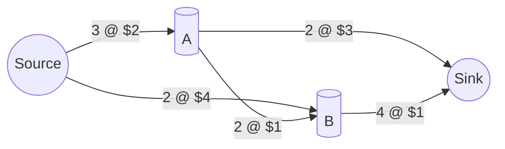

# Minimum Cost Maximum Flow (Successive Shortest Path)

## Problem Statement

We have a network of pipes (or roads) where each pipe can carry only a certain amount of water (capacity) and each unit of water has a cost. We want to send as much water as possible from a start node (source) to an end node (sink) while making the total cost as small as possible. 😊

## Real world scenarios

- Sending goods through a network of roads with tolls (minimize toll cost while moving all goods)
- Routing data through a network where each link has limited bandwidth and cost
- Scheduling tasks on machines with different costs and limits

## Solution

We use the "Successive Shortest Path" method with potentials to find the Minimum Cost Maximum Flow (MCMF).

Idea (very simple):
1. While we can still send more flow from source to sink:
   - Find the cheapest path from source to sink (respecting remaining capacities).
   - Send as much flow as we can through that path.
   - Update the costs and capacities.

We use potentials to make the Dijkstra algorithm work with edges that might have negative reduced costs.

Mermaid diagram:

Explanation for a kid:

- Imagine pipes with numbers like "3 @ $2" meaning the pipe can carry 3 units and each unit costs $2.
- We try to push water from Source to Sink. We always pick the cheapest way to add water, and repeat until we can't push more.

Here's a cute gif 🎈

## Conclusion

This algorithm helps find the fastest (cheapest) way to move as much stuff as possible through a network. It's fast and works well for many practical problems. 👍
