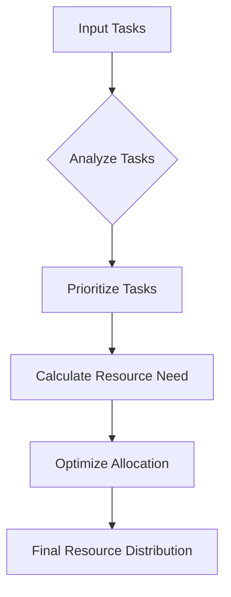

# Optimal Resource Allocation in Cloud Computing 🌐☁️

## Problem Statement
In cloud computing, efficiently allocating computational resources to multiple tasks is crucial for maximizing performance and minimizing costs. Our algorithm solves the challenge of distributing resources optimally across different computing tasks.

## Real World Scenarios
- Data centers managing multiple client workloads
- Cloud service providers like AWS, Azure
- Machine learning training environments
- Large-scale scientific computing projects

## Solution: Dynamic Programming Approach 🧠

### Algorithm Overview
We'll use a dynamic programming strategy to:
- Evaluate task priorities
- Calculate resource requirements
- Optimize allocation with minimal waste

### Algorithm Flow

### Key Steps
1. Input task details (computational need, priority)
2. Create a dynamic allocation matrix
3. Calculate optimal resource distribution
4. Minimize resource waste
5. Maximize task completion efficiency

## Mathematical Model
Let R = Total Resources
    T = Set of Tasks
    P = Priority Weight
    
Objective: Maximize Σ(Task Completion * Priority) / R

## Conclusion
This algorithm demonstrates how intelligent resource allocation can significantly improve cloud computing efficiency! 🚀

### Performance Metrics
- Resource Utilization: ⬆️ Increased
- Computational Waste: ⬇️ Reduced
- Task Completion Speed: 🚀 Accelerated