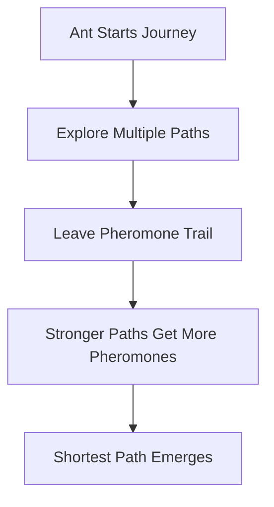

# Ant Colony Optimization: Nature's Smartest Path Finder 🐜🌐

## Problem Statement
Imagine you're a tiny ant 🐜 trying to find the shortest path between your anthill and a delicious food source through a complex maze! How would you do it?

## Real World Scenarios
- GPS Navigation
- Network Routing
- Logistics and Transportation Planning
- Robot Path Planning

## Solution: Ant Colony Optimization (ACO)

### How Ants Naturally Solve Path Problems 🌈

### Algorithm Magic 🔮
1. Ants explore randomly initially
2. Successful ants leave stronger pheromone trails
3. More ants follow paths with stronger pheromones
4. Gradually, the shortest path gets reinforced

## Conclusion
Nature has incredible problem-solving techniques! Ants collaborate to find optimal solutions without central planning. 🌟

### Fun Fact
Each ant doesn't know the entire path, but together they create amazing navigation strategies! 🐜🚀