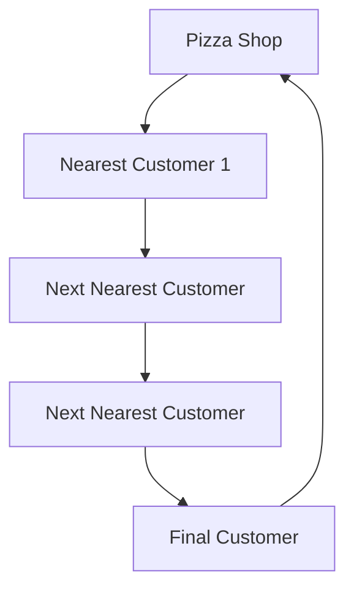

# 🍕 Optimizing Pizza Delivery Route Algorithm

## Problem Statement
Imagine you're a pizza delivery superhero 🦸‍♀️ who wants to deliver pizzas to multiple locations in the fastest and most efficient way possible! How can you plan the shortest route that visits all customers without wasting time?

## Real World Scenarios
- Pizza delivery services
- Courier companies
- Logistics and transportation planning
- Food delivery apps

## Solution: Nearest Neighbor Algorithm

The Nearest Neighbor Algorithm helps find the quickest route by always moving to the closest unvisited location.

### Algorithm Steps 🛵
1. Start at the pizza shop (starting point)
2. Find the nearest unvisited customer
3. Go to that customer and deliver pizza
4. Mark customer as visited
5. Repeat steps 2-4 until all customers are served
6. Return to the pizza shop

### Algorithm Visualization

## Complexity and Performance
- Time Complexity: O(n²)
- Space Complexity: O(n)
- Best for smaller number of delivery points

## Conclusion
This algorithm helps pizza delivery heroes find the most efficient route, saving time, fuel, and ensuring hot pizzas reach customers quickly! 🍕🚀

### Pro Tips
- Works best for a small number of delivery points
- Not guaranteed to find the absolute shortest route
- Great for quick, approximate route planning

### 🌟 Fun Fact
This algorithm is inspired by how ants find the shortest path to food!