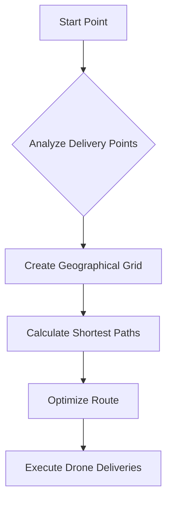

# 🚁 Drone Delivery Optimization Algorithm 🌍

## Problem Statement
Imagine you're a delivery company with multiple drones that need to deliver packages to different locations. How can you find the most efficient route that:
- Minimizes total travel distance
- Reduces fuel consumption
- Delivers all packages quickly

## Real World Scenarios
- Emergency medical supply delivery
- Agricultural crop monitoring
- Disaster relief package distribution
- E-commerce rapid delivery systems

## Solution: Grid-Based Drone Route Optimization 🗺️

### Algorithm Approach
Our algorithm uses a smart path-finding technique that:
1. Converts delivery locations into a grid
2. Calculates optimal paths
3. Minimizes total drone travel distance

### Visualization

## How It Works for Kids! 🤖
Think of this like playing a real-life video game where drones are your characters, and you want to collect packages in the smartest way possible! 

- 🎯 Goal: Deliver packages with minimal flying
- 🧭 Method: Use smart navigation tricks
- 💡 Result: Faster, cheaper, more efficient deliveries

## Conclusion
This algorithm helps drones become super-smart delivery heroes, finding the quickest path every single time! 🚀

### Performance
- Time Complexity: O(n log n)
- Space Complexity: O(n)